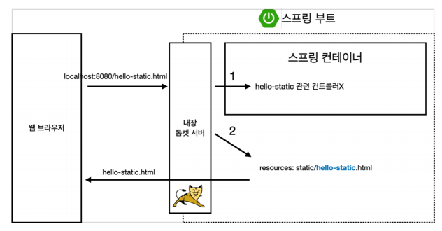
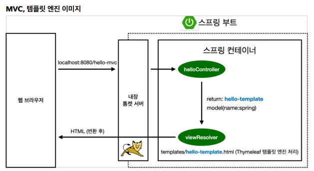
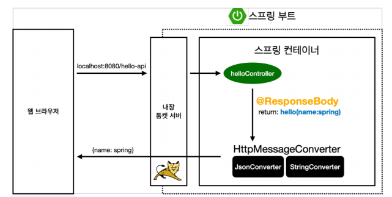

# Inflearn - SpringBoot

## 스프링 웹
 ### 1. Static Web

    - html파일 형식 같은 정적인 페이지

 ### 2. MVC와 템플릿 엔진

    - MVC란 모델 뷰 컨트롤러를 합친 뜻이다.
    - 정적 웹과 다르게 viewResolver에서 처리 후 변환하여 처리

 ### 3. API

    - 객체를 반환하는 방식
    - Converter를 통해 Json 혹은 그 외의 파일로 반환

