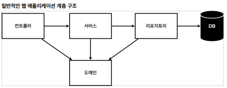

# Inflearn - SpringBoot

## 스프링 웹
 ### 1. Static Web

    - html파일 형식 같은 정적인 페이지

 ### 2. MVC와 템플릿 엔진

    - MVC란 모델 뷰 컨트롤러를 합친 뜻이다.
    - 정적 웹과 다르게 viewResolver에서 처리 후 변환하여 처리

 ### 3. API

    - 객체를 반환하는 방식
    - Converter를 통해 Json 혹은 그 외의 파일로 반환

## 비즈니스 요구사항

### 일반적인 웹 어플리케이션 계층 구조
- 컨트롤러 : 웹 MVC의 컨트롤러 역할
- 서비스 : 핵심 비즈니스 로직 구현
- 리포지토리 : 데이터베이스에 접근, 도메인 객체를 DB에 저장하고 관리
- 도메인 : 비즈니스 도메인 객체

### 클래스 의존관계
- 아직 데이터 저장소가 선정되지 않아서, 우선 인터페이스로 구현 클래스를 변경할 수 있도록 설계
- 데이터 저장소는 RDB, NoSQL등 다양히 이용 가능
- 개발을 진행하기 위해서 초기 개발 단계에서는 구현체로 가벼운 메모리 기반 데이터 저장소 사용

#### 내일 질문
--> 인프런 13분 쯤 생성자에 대한 것 질문

## 스프링 빈과 의존 관계
스프링 컨테이너? 의존관계 주입?

### 직접 Bean 등록